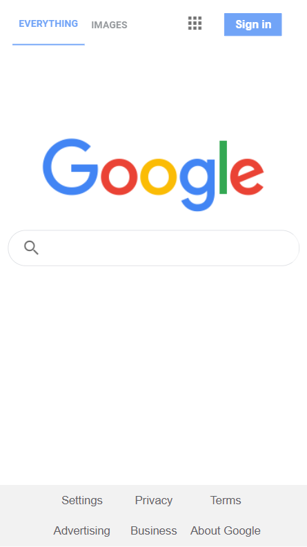
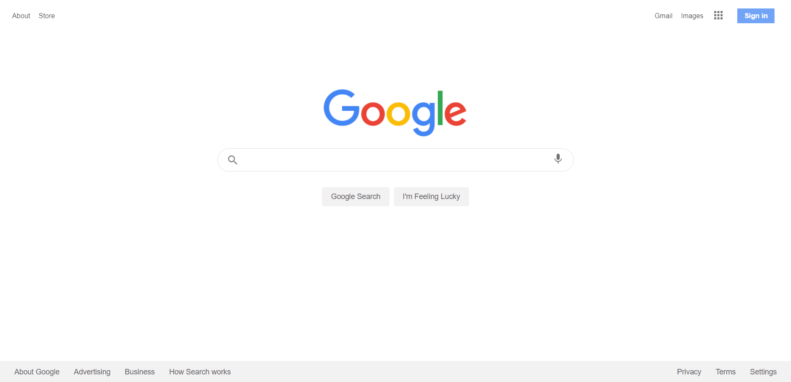

# Google Homepage Clone

This project consists in building a site that looks like the Google Homepage. It allows web development students to begin building so they can start getting the technical skills necessary to become a front-end developer. [Instructions here.](https://www.theodinproject.com/paths/foundations/courses/foundations/lessons/html-css)

## Mobile

## Desktop

## Built With

- HTML5
- CSS3
- VSCode
- Git & GitHub

## Live Demo

[Live Demo Link](https://dicodiaz.me/google-homepage/)

## Getting Started

To get this project up and running, follow these simple steps:

1. Clone the repository into your machine (Or download the .zip file and extract).
2. Open the project's folder.
3. Open `index.html`

### Setup

Follow the steps described before.

## Authors

👤 **Dico Diaz Dussan**

- GitHub: [@dicodiaz](https://github.com/dicodiaz)
- LinkedIn: [Dico Diaz Dussan](https://www.linkedin.com/in/dico-diaz-dussan)
- Portfolio: [dicodiaz.com.co](https://dicodiaz.com.co)

## 🤝 Contributing

Contributions, issues, and feature requests are welcome!

Feel free to check the [issues page](../../issues/).

## Show your support

Give a ⭐️ if you like this project!

## Acknowledgments

- [The Odin Project](https://www.theodinproject.com)

## 📝 License

This project is [MIT](./MIT.md) licensed.
